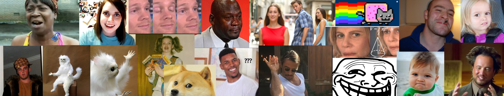
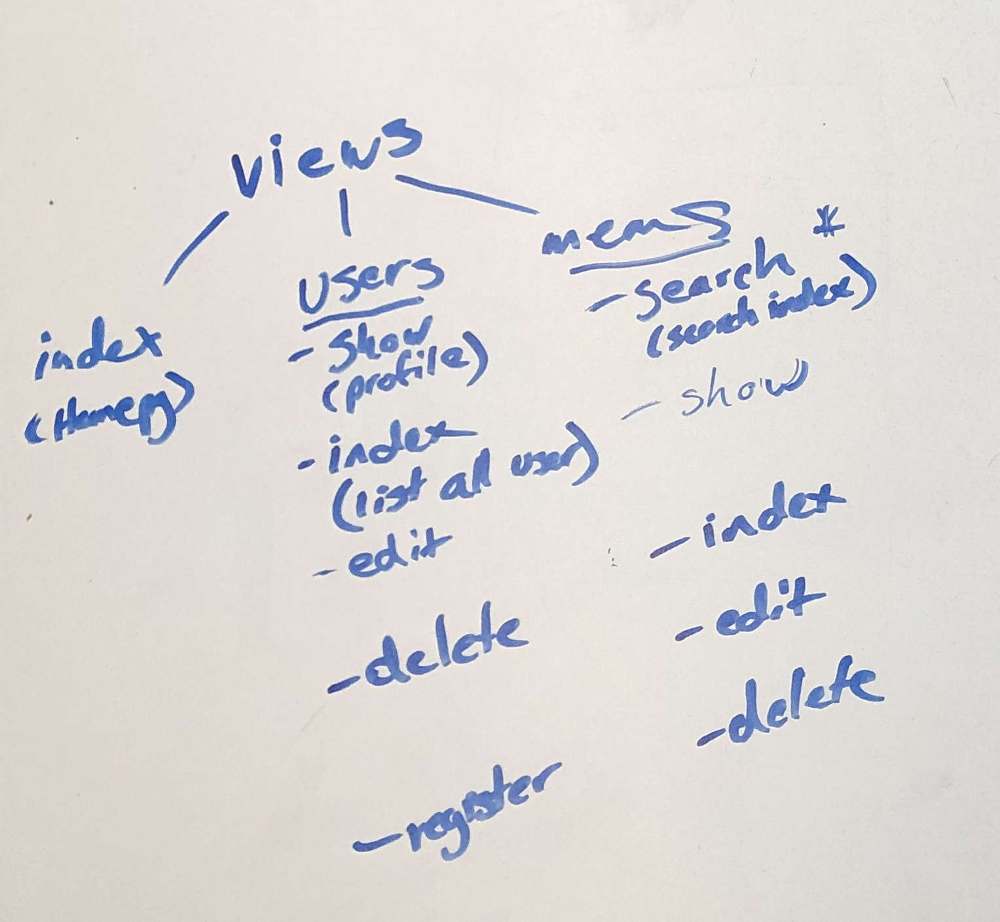
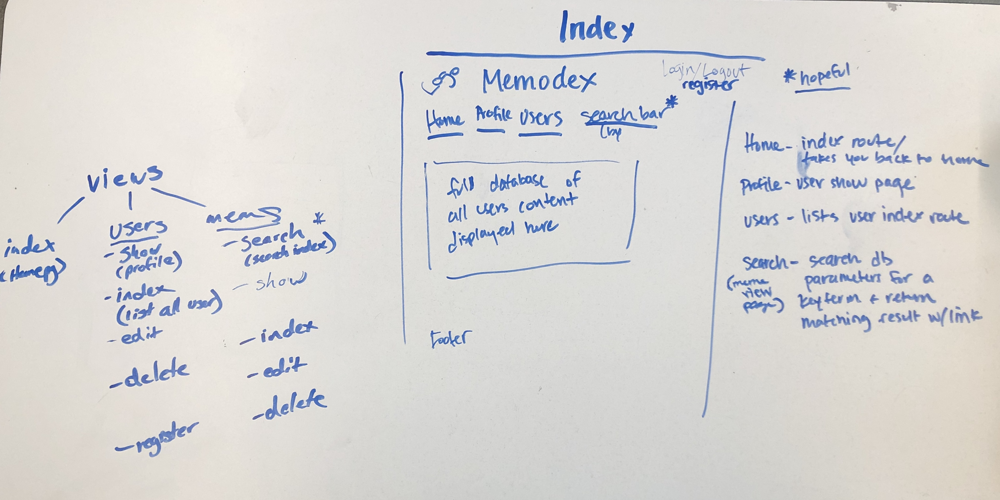
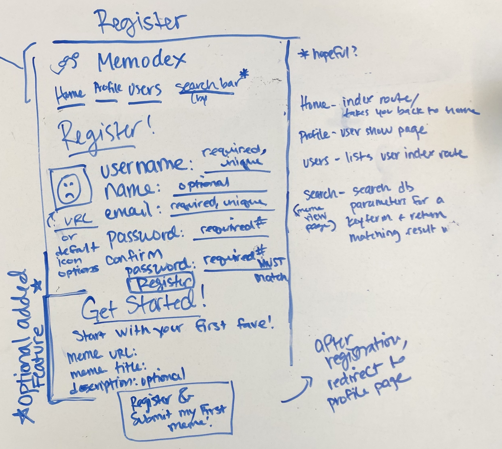
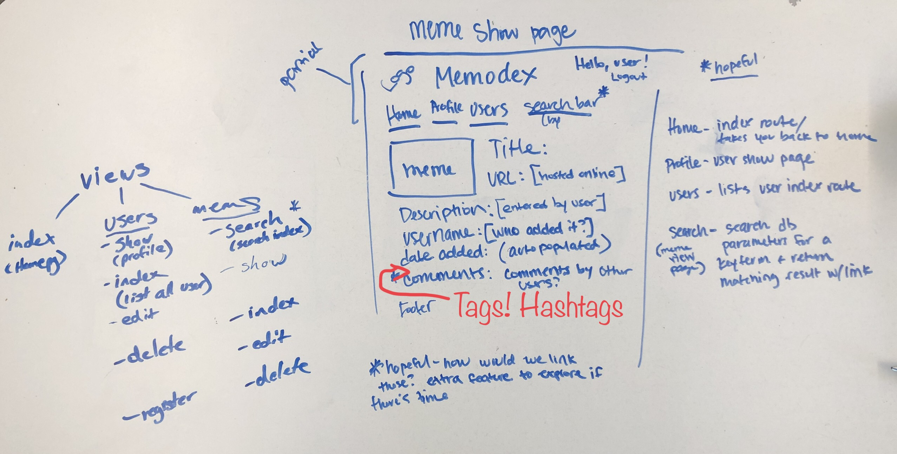
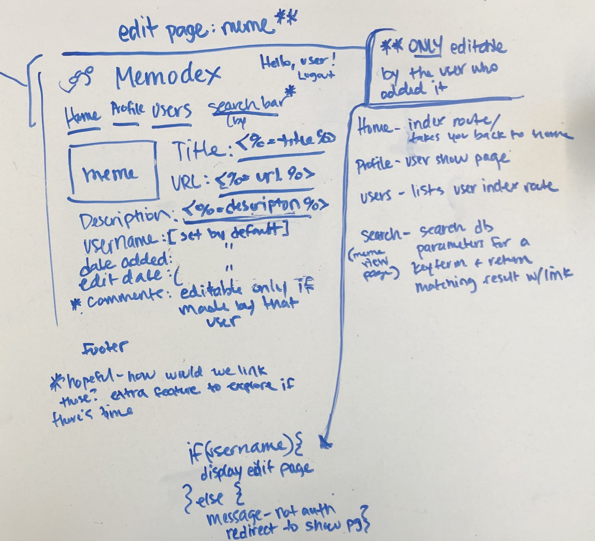

# MEMEODEX

## A virtual rolodex of your favorite memes!
### Why do you need this?
> Your BFF texts something funny and you want to respond with your favorite gif or a screenshot you took of a relateable meme that totally applies to their hilarious joke.  But, you have 5,467 images in your phone, where *IS* that screenshot you took of that one meme? You can **totally** picture it, but by the time you've scrolled through 3 months of photos in your phone, *the moment has passed*. You now seem 11% less funny than you actually are!   
> 

## Memeodex can restore you to your naturally funny, quick-witted self!
Memeodex is a personal database curated **by** you, **for** you, to store links to your favorite memes - be it gifs, images, videos - if it lives on the internet, it can live in your database too!  Any time you come across a meme you want to reference later, you store it in your database and **behold** you have a quick reference to that funny meme at the tip of your fingertips!  Sure, there are other meme websites out there, but they are allll the memes, not just the GOOD ones.  Here, you get to organize your collection, just how you like it!

### Yes! Please, tell me how!
1. [Click here to go to Memeodex!](https://memeodex.herokuapp.com/)
2. click "Register" on the home page and create a username and profile.
3. Start adding your memes to your database!
    - From your profile page or the memes page, you can click on the link to add a meme
    - Then, all you need is a url (where you meme lives on the internet!), a title (you choose this), a description (optional), tags (also optional, but they will help you in your search later, as your meme database grows!).
4. You can also explore other users' memes.

### Technologies Used
- JavaScript
- HTML5
- CSS3 (Flexbox, Materialize)
- Express
- MongoDB
- Mongoose 

### Wireframe
#### Planning the layout of the web app views
##### Deciding on the views for each model:

##### The Home page

##### User Registration page

##### User Profile(show) page
.jpg)
##### User Edit page
.jpg)
##### Meme Show page

##### Meme edit page

### The Group
This project is being worked on by Austin Suen and Erin Johnson.  Erin was the github manager. Erin drafted the readme file, worked on the user model and user CRUD routes/controllers and set up the login and password encryption/authentication verifications and worked with materialize to make the nav-bar drop down when the page re-sizes and is very proud of the collage she put together as the page banner. Austin worked on the meme model and meme CRUD routes/controllers, and took on the bulk of the styling and the functionality specifically relating to styling and modals.  Erin and Austin worked well together when discussing style and troubleshooting issues.

#### Future Features We'd Love to Add
- Search by tags and/or usernames
- Add comments to other users' memes
- 'Like' other users' memes
- Add other users' memes to your own meme database
- Add a 'Get Started' section on the register page that allows the user to submit their first meme when registering

#### Road blocks or works in progress
- only set up to host videos from youtube right now
- cannot host content from Tenor - it appears they have some kind of restriction set up
- video will process as an image (and fail) if the checkbox isn't checked