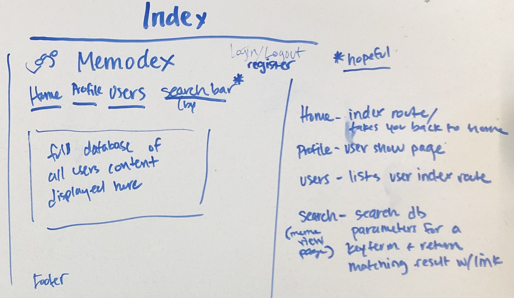
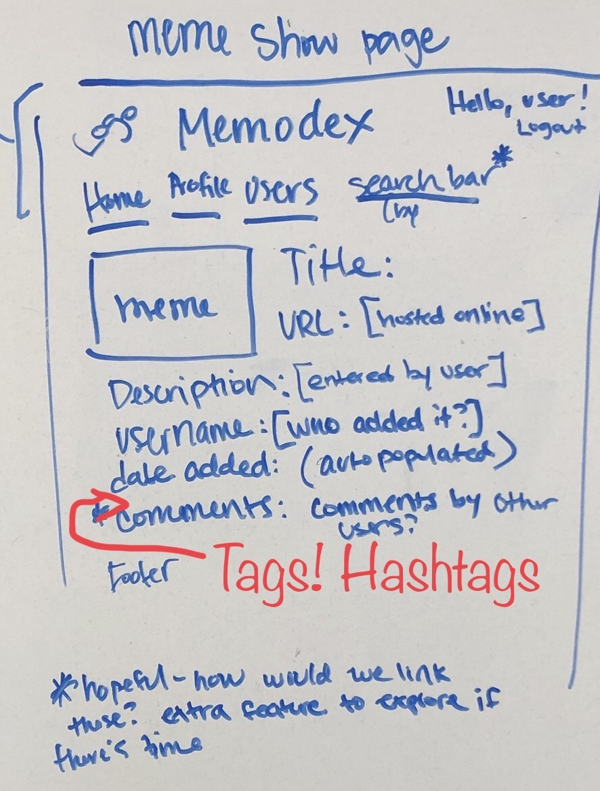

# MEMEODEX
//put an image/logo here

## A virtual rolodex of your favorite memes!
### Why do you need this?
> Your BFF texts something funny and you want to respond with your favorite gif or a screenshot you took of a relateable meme that totally applies to their hilarious joke.  But, you have 5,467 images in your phone, where *IS* that screenshot you took of that one meme? You can **totally** picture it, but by the time you've scrolled through 3 months of photos in your phone, *the moment has passed*. You now seem 11% less funny than you actually are!   
> 

## Memeodex can restore you to your naturally funny, quick-witted self!
Memeodex is a personal database curated **by** you, **for** you, to store links to your favorite memes - be it gifs, images, videos - if it lives on the internet, it can live in your database too!  Any time you come across a meme you want to reference later, you store it in your database and **behold** you have a quick reference to that funny meme at the tip of your fingertips!  Sure, there are other meme websites out there, but they are allll the memes, not just the GOOD ones.  Here, you get to organize your collection, just how you like it!

### Yes! Please, tell me how!
1. [click here to use Memeodex](github link to memeodex here)
2. click "Register" on the home page and create a username and profile.
3. Start adding your memes to your database: 
    - all you need is a url (where your meme lives on the internet!), a title (you choose this), a description (optional), hashtags (also optional, but they will help you in your search later, as your meme database grows!).
4. You can also explore other users' memes, like them, comment on them, and save them to your own profile for later.

### Technologies Used
- JavaScript
- HTML5
- CSS3 (Bootstrap?, Flexbox?)
- Express
- MongoDB
- Mongoose 

### Wireframe
#### Planning the layout of the web app views
##### Deciding on the views for each model:

##### The Home page

##### User Registration page

##### User Profile(show) page
.jpg)
##### User Edit page
.jpg)
##### Meme Show page

##### Meme edit page

### The Group
This project is being worked on by Austin Suen and Erin Johnson.  Erin will be the github manager. To start off the project, Erin will be working on the readme file, and Austin will be working on the wireframes for the readme file. After finalizing the project plan, Erin will work on the User model/controllers/routes/views and Austin will work on the meme model/controllers/routes/views.  We will work together to style the pages, troubleshoot any specific issues, and if there's time, to add any additional features we are considering.

#### Potential Additional Features
- Search by hashtags
- Add comments to other user's memes
- 'Like' other user's memes
- Add other user's memes to your own meme database
- Add a 'Get Started' page on the register page that allows the user to submit their first meme when registering
